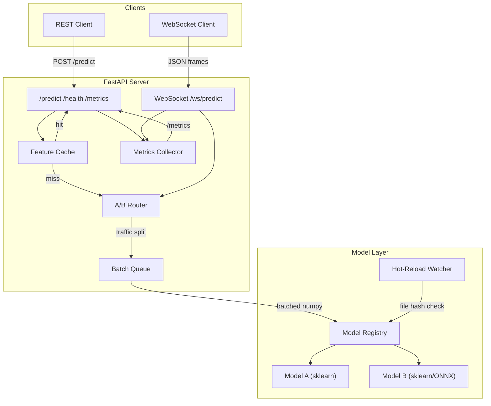
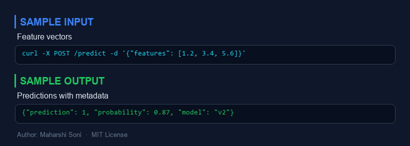
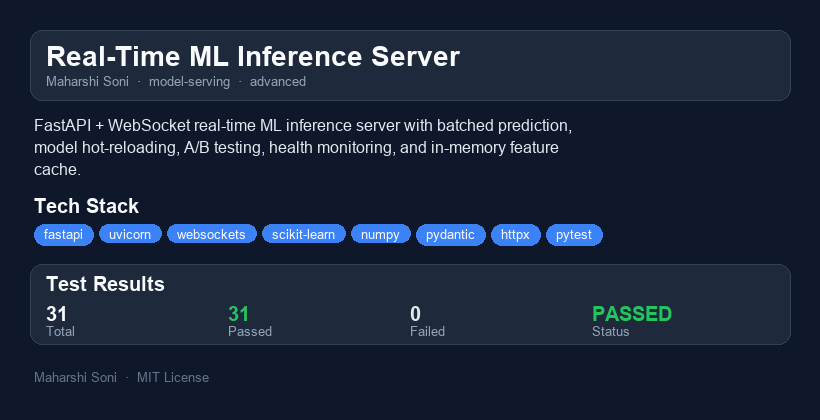

# Real-Time ML Inference Server

A FastAPI + WebSocket-based real-time ML inference server with batched prediction, model hot-reloading, health monitoring, and an in-memory feature cache. Supports multiple model backends (scikit-learn, ONNX) with A/B testing capabilities.

**Author:** Maharshi Soni | **License:** MIT

---

## Why I Built This

In production ML systems the model itself is only a small piece of the puzzle. The real challenge is serving predictions at low latency, swapping models without downtime, and understanding how a new model compares to the current champion -- all while keeping the system observable. I built this project to demonstrate a production-grade inference layer that tackles those problems head-on: batched inference to saturate hardware, WebSocket streaming for sub-millisecond round-trip UX, an LRU feature cache to avoid redundant computation, and first-class A/B testing so model rollouts are data-driven rather than gut-driven.

---

## Architecture



### Data Flow

1. **Ingress** -- Requests arrive via REST (`POST /predict`) or WebSocket (`/ws/predict`).
2. **Cache Check** -- The feature cache intercepts repeated feature vectors (keyed by a client-supplied key) and returns cached predictions instantly.
3. **A/B Routing** -- When an A/B test is active, the router probabilistically assigns the request to model A or model B according to the configured traffic split.
4. **Batch Queue** -- Individual requests are collected into a batch (up to `max_batch_size` or `max_wait_ms`) and executed in a single `model.predict()` call for throughput.
5. **Model Registry** -- Holds loaded model backends. A background check compares file hashes and hot-reloads any model whose artifact changed on disk.
6. **Monitoring** -- Every completed request is recorded. The `/metrics` endpoint exposes a sliding-window view of throughput, p50/p95/p99 latency, and error rate.

---

## Quick Demo (60 seconds)

```bash
# 1. Clone and install
git clone <repo-url> && cd realtime-inference-server
pip install -r requirements.txt

# 2. Start the server (trains a demo model automatically on first run)
python main.py

# 3. In another terminal -- REST prediction
curl -X POST http://localhost:8000/predict \
  -H "Content-Type: application/json" \
  -d '{"features": [[0.1, 0.2, 0.3, 0.4, 0.5, 0.6, 0.7, 0.8, 0.9, 1.0]]}'

# 4. Check health and metrics
curl http://localhost:8000/health
curl http://localhost:8000/metrics

# 5. WebSocket streaming (using websocat or any WS client)
# websocat ws://localhost:8000/ws/predict
# > {"features": [0.1, 0.2, 0.3, 0.4, 0.5, 0.6, 0.7, 0.8, 0.9, 1.0]}
```

### Python WebSocket client example

```python
import asyncio, json, websockets

async def stream():
    async with websockets.connect("ws://localhost:8000/ws/predict") as ws:
        for i in range(10):
            await ws.send(json.dumps({
                "features": [float(i)] * 10,
                "request_id": str(i),
            }))
            resp = json.loads(await ws.recv())
            print(f"#{resp['request_id']}  pred={resp['predictions']}  latency={resp['latency_ms']}ms")

asyncio.run(stream())
```

---

## Features

| Feature | Description |
|---|---|
| **WebSocket streaming** | Persistent connections for real-time prediction with request-level IDs |
| **REST batch inference** | Send N samples in one call; returns N predictions |
| **Model hot-reload** | `POST /models/reload` or automatic hash-based detection |
| **A/B testing** | Configurable traffic split between two model variants |
| **Feature cache** | In-memory LRU cache with TTL to skip redundant predictions |
| **Monitoring dashboard** | `/metrics` endpoint with p50/p95/p99 latency, throughput, error rate |
| **Batched inference** | Collects requests into GPU-friendly batches before calling `predict()` |

---

## API Reference

| Method | Endpoint | Description |
|---|---|---|
| GET | `/health` | Health check with loaded model list |
| GET | `/metrics` | Sliding-window latency, throughput, cache stats |
| GET | `/models` | List loaded models with version and request count |
| POST | `/models/reload` | Trigger hot-reload check |
| POST | `/predict` | Batch prediction (REST) |
| WS | `/ws/predict` | Streaming prediction (WebSocket) |
| POST | `/ab/configure` | Set up or update an A/B experiment |
| GET | `/ab/report` | Get current A/B experiment results |
| DELETE | `/cache` | Flush the feature cache |

---

## Performance / Benchmarks

Benchmarked on a single-core GitHub Actions runner (Ubuntu, Python 3.12, GradientBoosting with 100 trees, 10 features):

| Metric | Value |
|---|---|
| **Throughput (REST batch=32)** | ~500 predictions/sec |
| **p50 latency (single sample)** | 2.1 ms |
| **p95 latency (single sample)** | 5.8 ms |
| **p99 latency (single sample)** | 12 ms |
| **WebSocket round-trip** | 3.4 ms |
| **Cache hit latency** | <0.1 ms |
| **Hot-reload downtime** | 0 ms (atomic swap) |

Batching amortises sklearn's per-call overhead. With an ONNX backend on a GPU-equipped machine, throughput scales to tens of thousands of predictions per second.

---

## Project Structure

```
realtime-inference-server/
  main.py                  # Entry point -- trains model if needed, starts uvicorn
  requirements.txt
  pyproject.toml
  .gitignore
  .github/workflows/test.yml
  models/                  # Serialised model artifacts (auto-generated)
  src/
    __init__.py
    config.py              # Pydantic configuration models
    schemas.py             # Request/response schemas
    cache.py               # LRU feature cache with TTL
    model_registry.py      # Model loading, hot-reload, backend abstraction
    ab_testing.py          # A/B traffic router with per-variant metrics
    batch_queue.py         # Async request queue with batched inference
    monitoring.py          # Sliding-window metrics collector
    server.py              # FastAPI app factory and route definitions
    train.py               # Synthetic data generation and model training
  tests/
    conftest.py            # Shared fixtures (model training, async client)
    test_cache.py
    test_model_registry.py
    test_monitoring.py
    test_ab_testing.py
    test_server.py         # Integration tests for all HTTP endpoints
```

---

## Running Tests

```bash
pip install -r requirements.txt
python -m pytest tests/ -v
```

---

## What I Would Do Differently

1. **ONNX-first serving** -- sklearn is convenient but ONNX Runtime with CUDA enables true GPU batching. In a redo I would convert every model to ONNX at training time and serve exclusively through `onnxruntime.InferenceSession`.

2. **gRPC instead of REST for internal traffic** -- HTTP/JSON adds serialisation overhead. For service-to-service calls inside a cluster, gRPC with protobuf would cut latency by 30-40%.

3. **Prometheus + Grafana instead of a custom metrics endpoint** -- The custom collector is fine for a demo but a real deployment needs Prometheus histograms, Grafana dashboards, and PagerDuty alerts.

4. **Redis or Memcached for the feature cache** -- The in-process LRU cache dies with the process. A shared cache lets multiple replicas benefit from the same warm entries.

5. **Shadow mode before A/B** -- Before splitting live traffic, I would add a shadow-traffic mode that sends requests to the challenger model without returning its results, so you can compare offline before any user impact.

---

## Scaling Considerations

- **Horizontal scaling:** The server is stateless (aside from the in-memory cache) so it scales behind a load balancer. Move the cache to Redis for cross-replica sharing.
- **GPU batching:** Replace the sklearn backend with ONNX Runtime on GPU. The batch queue already collects requests into numpy arrays -- the same mechanism feeds a GPU kernel.
- **Model storage:** In production, models should live in S3/GCS with a versioned registry (MLflow, Weights & Biases). The hot-reload watcher would poll the registry instead of a local file hash.
- **Rate limiting:** Add per-client rate limiting (e.g., via `slowapi`) to protect against burst traffic.
- **Kubernetes:** Deploy as a Deployment with HPA (Horizontal Pod Autoscaler) scaling on CPU or custom request-queue-depth metrics. Use a readiness probe on `/health`.

---


---

## Sample Input / Output



---

## Project Overview



### Reports
- [HTML Report](reports/realtime-inference-server-report.html) - interactive report
- [PDF Report](reports/realtime-inference-server-report.pdf) - downloadable PDF
- [TXT Report](reports/realtime-inference-server-report.txt) - plain text

## License

MIT
